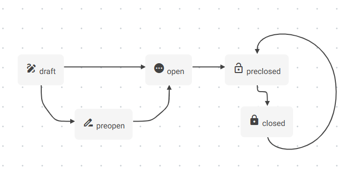
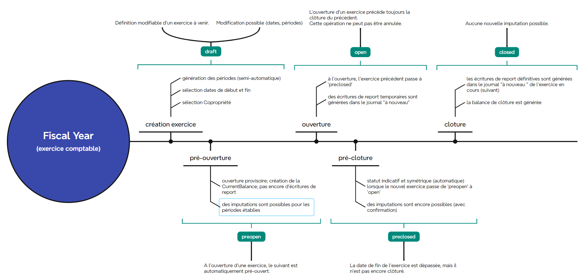

## Exercices comptables

Chaque ACP définit son exercice comptable en AG :

- Généralement d’un an, parfois allongé ou raccourci pour le premier exercice ou suite à un changement de syndic.
- Peut se terminer n’importe quel mois de l’année.

- Décompte annuel adapté selon l’exercice.

Les dates d'exercice sont définies dans les statuts mais peuvent être modifiées en AG.

L'exercice , en principe, toujours une durée d'un an (exception possible pour le premier), mais les dates de début et de fin sont arbitraires.

**Périodes** pour les décomptes de charges : 

* trimestriel
* quadrimestriel
* semestriel
* annuel 

Note : La numérotation des factures d'achat peut prendre en compte la période (avec la numérotation qui recommence à chaque période).


Il faut toujours gérer deux exercices comptables en parallèle (en cours et suivant):

* il ne peut y avoir qu'un seul exercice comptable en cours (sur base de la date du jour ou de la pièce encodée)
* on n'autorise pas l'imputation à plus d'un exercice dans le futur


=> Possibilité d'imputer sur :

* exercice précédent (non clôturé)
* exercice en cours
* exercice à venir

A la clôture d'un exercice comptable, on doit envoyer une série de documents au commissaire aux comptes (obligatoire).


### Création et gestion des exercices comptables

- Ouverture d'un nouvel exercice comptable 
  - Créer automatiquement l'exercice suivant lors de l’ouverture d’un nouvel exercice.
  - Vérifier l’unicité de l’exercice en cours (un seul exercice actif à un instant donné)
- Permettre de définir la date de début et de fin (durée) sur base des dates définies en AG 
  - Vérifier et imposer la continuité des dates pour assurer la cohérence des exercices.

- Gérer la périodicité des décomptes (trimestriel, quadrimestriel, semestriel, annuel) avec possibilité d’assigner manuellement.
  - Proposition d’un template de périodes modifiable par ACP.
  - Contrôler la continuité des périodes de décompte lors de l’enregistrement des factures.

- Limiter l’imputation aux exercices autorisés 
  - Autoriser les écritures pour l'exercice précédent (non clôturé), l'exercice en cours, et l'exercice à venir
  - Interdire l’imputation à plus d’un exercice dans le futur.


A la création d'un exercice (pour une copropriété), 

* crééer une séquence par période:

​	Sequences (setting avec [condo_id] ): 
​	```finance, accounting, invoice.period_sequence.{fiscal_year_code}.{fiscal_period_code}``` 

* ouvrir le nouveau (l'exercice comptable en cours dépend de la date du jour)
* créer celui de l'année +1

action : `finance/accounting/fiscalyear::open`

​	


### Workflow (`FiscalYear`)

Le workflow dédouble certains états afin de permettre de gérer le différé de clôture de l'exercice et autoriser la réception tardive des factures et paiements.

Les états possibles sont les suivants, et il n'est jamais possible de revenir en arrière (à l'exception des brouillons qui peuvent être supprimés):

```Brouillon > Pre-open > Open > Pre-closed > Closed```

Des écritures peuvent être imputées uniquement aux exercices `pre-open`, `open` et `pre-closed`.

Postulats : 

* Une copropriété est toujours associée à un exercice ouvert (à l'exception des nouvelles copropriétés, pour lesquelles il y a une opération spécifique "premier exercice"). 
* Lorsqu'un exercice est ouvert, il y a toujours un exercice suivant pré-ouvert, et un exercice précédent pré-clôturé ou clôturé.





Les exercices se suivent toujours selon la séquence suivante : 

| open          | preopen       | draft \|[]  |                 |                 |
| ------------- | ------------- | ----------- | --------------- | --------------- |
| **preclosed** | **open**      | **preopen** | **draft \| []** |                 |
| **closed**    | **open**      | **preopen** | **draft \| []** |                 |
|               | **preclosed** | **open**    | **preopen**     | **draft \| []** |
|               | **closed**    | **open**    | **preopen**     | **draft \|[]**  |





#### Brouillon

A ce stade il est possible de créer et modifier les dates de fin et de début d'exercice, ainsi que celles des périodes: soit de manière arbitraire, soit selon la périodicité définie pour la Copropriété.

Par défaut la date de début est celle de la date définie en AG, et la date de fin correspond à cette date +1an -1 jour.


#### Pré-ouverture

La cohérence des périodes est vérifiée. Si une incohérence est détectée la transition est refusée et l'exercice reste en brouillon.

En cas de succès, une **balance courante** est créée et associée à l'exercice.

- les **dates de début et de fin** de l’exercice sont figées;
- la configuration des **périodes comptables** est figée (dates et ordre);
- les **séquences** de numérotation des pièces comptables sont générées.


Si nécessaires les périodes d'un exercice pré-ouvert peuvent être modifiées via une opération spécifique (qui prend en charge les réassignations des écritures aux nouvelles périodes).


#### Ouverture

Par convention, l'ouverture d'un exercice précède toujours la fermeture du précédent.

Pour pouvoir ouvrir un exercice, il faut qu'il soit à l'état `pre-open` , que l'exercice précédent soit à l'état `open`, et que l'exercice encore précédent soit à l'état `closed` ou `preclosed`(il peut arriver qu'il y ait plusieurs exercices non clôturés en plus de l'exercice en cours).

Lors de l'ouverture d'un exercice (passage de `pre-open` à `open`):

* S'il n'y a pas d'exercice suivant, un brouillon (`draft`) est généré automatiquement avec des périodes identiques à l'exercice en cours
* L'exercice suivant est passé de l'état `draft` à l'état `pre-open` (un erreur survient en cas d'incohérence)
* L'exercice précédent (en cours au moment de l'ouverture), est passé à l'état `pre-closed`.
* Des écritures temporaires pour le report des soldes du bilan sont générées dans le **journal "ouverture"** de l'exercice suivant. Ces écritures permettent d'avoir un aperçu des reports de soldes avant la clôture définitive, et seront supprimées et re-générées lors de la clôture définitive de l'exercice précédent


En cas de modification exceptionnelle de la durée de l'exercice, les périodes d'un exercice ouvert peuvent être modifiées via une opération spécifique (permettant d'allonger, de raccourcir ou de supprimer certains périodes, et de réassigner les écritures ).


#### Pré-cloture

Lorsqu'un exercice a été ouvert, le précédent passe en `pre-closed`. Il s'agit d'un statut indicatif (et automatique), qui permet d'attendre que toutes les pièces comptables d'un exercice aient été reçues et encodées avant de le clôturer.

Une fois pré-cloturé, des imputations sur l'exercice continuent d'être possibles.

Note: Si un exercice est pré-cloturé, on considère que la date de fin de l'exercice est dépassée.


#### Clôture

La clôture est une opération qui se fait manuellement, et possible uniquement lorsqu'un exercice est à l'état `pre-closed`.

* **Suppression des écritures temporaires** du journal "ouverture" du nouvel exercice.
* **Génération des nouvelles écritures définitives** basées sur la balance de bilan clôturée du précédent exercice.

Une fois l'exercice clôturé, les soldes des comptes de bilan sont reportés de manière définitive et aucune nouvelle imputation n'est possible, sauf réouverture exceptionnelle.

Si une erreur comptable est détectée après clôture, il faut passer une écriture d’ajustement dans l’exercice suivant.

Une fois un exercice définitivement clôturé, les éventuelles écritures liées à des ajustements spécifiques peuvent être réalisées (Régularisations fiscales, Amortissements, Provisions).


### Création des périodes

Les écritures sont toujours associées à une période comptable, afin de permettre de générer des balances périodiques.

Par défaut, les périodes pour l'exercice suivant sont configurées de manière identique à l'exercice en cours.


Il existe 3 cas particuliers pour la création des périodes des exercices :

**1) Première ouverture** - *Un immeuble neuf où le premier exercice démarre à la date de réception provisoire des parties communes ou la date de réception provisoire de la 1ère partie privative pour se terminer à une date déterminée en AG. Ce 1er exercice est parfois plus long que 12 mois, parfois plus court mais les suivants seront de nouveau de 12 mois à partir de la date de fin du 1er. En cas de décompte trimestriel, c’est uniquement la 1ère période au sein du 1er exercice qui sera plus longue ou plus courte que 3 mois puis on aura d’office des décomptes de 3 mois en 3 mois (même logique pour les autres périodicités possibles).*

Une distinction est faite entre la date réelle de début d'exercice (`date_init`) et la date théorique (`date_from`)
Il faut commencer par trouver la date de début théorique d'exercice (`date_from`), par rapport à la date de fin renseignée (```date_to - 1year + 1day```)
Ensuite, il faut créer les périodes de la même manière que pour l'ouverture "classique", avec deux exceptions:

* pour la première période, 
  si (`date_from` < `date_init`) ou si (`date_from` > `date_init`) => `date_from` = `date_init`
* pour toutes les périodes, 
  si `date_to` < `date_init` => ignore


**2) Modification** - *L’Assemblée Générale des copropriétaires décide de modifier l’exercice comptable de la copropriété. C’est rare mais ça peut arriver et on aura donc un exercice plus court ou plus long avant de revenir à des exercices de 12 mois. Il faut donc pouvoir modifier des exercices en adaptant les éventuels écritures qui s’y trouveraient dans les nouvelles périodes.*

En cas de modification des périodes, il faut forcer un recalcul des assignations de périodes et des balances périodiques s'il y en a (il n'y a pas d'impact sur la balance courante).


**3) Clôture anticipée** - *La fin du mandat d’un syndic intervient en cours d’année ou de trimestre (ce dont on ne peut pas tenir compte à la création de l’exercice puisque l’info n’est pas encore connue). Il faut permettre au syndic de modifier la date de fin qui servira à comptabiliser des charges pour une période donnée (tout en bloquant la date de début au 1er jour suivant le dernier décompte comptabilisé pour éviter qu’il puisse y avoir des trous).*


Ceci implique l'existance de l'exercice suivant en 'preopen' (s'il n'existe pas il faut le créer). 

* modifier la date de début de l'exercice suivant (date fin+1), avec les modifications d'assignation des écritures s'il y en a;
* modifier la date de fin de l'exercice(supprimer les périodes postérieures à cette date de fin, et modification des assignations d'écritures aux périodes correspondantes de l'exercice suivant);
* "fermeture classique" : mettre l'exercice en `pre-closed`, et l'exercice suivant en `open`.
* (dans le cas où il y a déjà des écritures imputées à l'exercice suivant, c'est la responsabilité de l'ancien syndic de transmettre les infos et les pièces)


### Gestion des imputations et numérotation des pièces comptables

- Les écritures comptables sont attribuées à un exercice selon la date de la pièce comptable.
- La numérotation des pièces (factures d'achat) est appliquée sur base de la période définie dans l’exercice.


### Pièces de clôture

Après la clôture d'un exercice, une archive de clôture peut être générée, reprenant les pièces comptables (bilan, balances, liste de frais) à envoyer au commissaire aux comptes (ZIP contenant les fichiers XLS).


