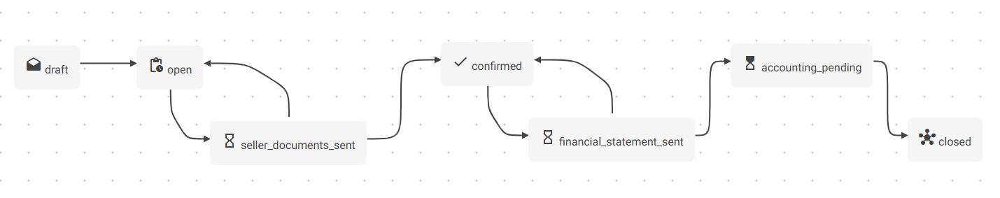

# Gestion des mutations (transferts de propriété)

La **mutation** d’un bien dans une copropriété correspond au **transfert de propriété d’un lot** d’un ancien copropriétaire (vendeur) vers un nouveau (acquéreur). Ce processus implique :

- Des **obligations légales** de transmission d’informations au notaire
- Des **ajustements comptables** en termes de fonds et charges
- Des impacts sur les **droits de propriété** enregistrés dans le système

Le système prend en charge ce processus via une entité centrale `OwnershipTransfer`, un **workflow métier** bien défini et des fonctions automatisées (y compris IA et comptabilité).

## Structure du processus

Le processus est scindé en deux volets complémentaires :

| Volet                            | Description                                              |
| -------------------------------- | -------------------------------------------------------- |
| **Administratif & documentaire** | Échanges formels avec le notaire via `OwnershipTransfer` |
| **Comptable & financier**        | Ajustement des fonds de roulement, charges, et écritures |

Ces deux volets sont coordonnés mais traités indépendamment, avec un déclenchement possible du volet comptable dès que la date de mutation est confirmée (`transfer_date`).

## Gestion administrative & échanges notariaux

### 1. Trois niveaux d’informations

| Moment                 | Référence légale         | Contenu transmis                                             |
| ---------------------- | ------------------------ | ------------------------------------------------------------ |
| **Avant compromis**    | Art. 3.94 §1 / 577-11 §1 | État des appels de fonds, litiges en cours, documents comptables (3 derniers PV, 2 derniers décomptes…), documents d’identification |
| **Après compromis**    | Art. 3.94 §2 / 577-11 §2 | Budget, montant des charges, travaux votés en AG, frais d’acquisition des communs, litiges judiciaires, solde du vendeur |
| **Après acte notarié** | Art. 3.94 §3             | Attestation confirmant la mutation (signature de l’acte), déclencheur de la phase comptable |

Certains champs permettant de compléter la traçabilité des transmissions:

*  `request_date`, 
*  `confirmation_date`
*  `transfer_date`
*  `seller_documents_sent_date` 
*  `financial_statement_sent_date`

### 2. Workflow `OwnershipTransfer`

| État                       | Description                                                  | Transitions possibles                   |
| -------------------------- | ------------------------------------------------------------ | --------------------------------------- |
| `draft`                    | Dossier initial encodé (IA ou assistant)                     | → `open`                                |
| `open`                     | Dossier complet, prêt à être envoyé                          | → `seller_documents_sent`               |
| `seller_documents_sent`    | Documents envoyés avant compromis                            | → `confirmed` ou `to_complete`          |
| `confirmed`                | Compromis signé                                              | → `financial_statement_sent`            |
| `financial_statement_sent` | Documents complémentaires envoyés                            | → `accounting_pending` ou `to_complete` |
| `accounting_pending`       | Acte signé, en attente de traitement comptable (et de la réception de l'acte notarié) | → `closed`                              |
| `closed`                   | Mutation définitivement clôturée                             | *(Aucun retour possible)*               |

## Description des informations par étape

### A. seller_documents (Art. 3.94 §1)

Le courrier de réponse doit être envoyé dans les 15 jours suivant la demande de l'étude du notaire (basé sur `request_date`).

#### 1 - montants des fonds de roulement et fonds de réserve

* Situation instantanée (balance comptable), basée sur la date de la demande du notaire (`request_date`), reprenant **tous les fonds de la copropriété** (roulement, réserves, réserves spéciales) : il peut y avoir plusieurs fonds de réserve avec des clés de répartition différentes, donc plusieurs lignes.

#### 2 - montant des arriérés éventuels dus par le cédant

Si le courrier concerne les deux paragraphes, ne rien renseigner ici et ajouter une mention "Voir point 3.94 §2, 5° (ci-dessous)."

* les arriérés du vendeur (montants non payés à la date de la demande - sur base des paiements attendus [Funding]): les arriérés à renseigner concernent tous les biens du copropriétaire au sein de la copropriété, indépendamment de la vente

* une ligne reprenant les frais de dossier - selon "catalogue" des tarifs du syndic (contrat) [[montants forfaitaires pour: frais de rappel, frais de dossier mutation, ...]] (loi : "entièrement à charge vendeur") - cette valeur doit être renseignée explicitement dans le Ownership transfer, après synchro avec la config du Condominium, et mis à jour à chaque courrier, si nécessaire.

#### 3 - la situation des appels de fonds, destinés au fonds de réserve et décidés par l'assemblée générale avant la date certaine du transfert de la propriété;

Ce paragraphe doit faire référence aux points suivants du dernier PV d'AG, repris en pièce jointe (@attachments): fonds de réserve, fonds de roulement et budget

#### 4 - le cas échéant, le relevé des procédures judiciaires en cours relatives à la copropriété;

* Si des procédures judiciaires sont en cours, il faut le préciser ("oui").
* Un descriptif doit reprendre un texte de description succincte pour chaque procédure, ainsi que les montants en jeux.

#### 5 - les procès-verbaux des assemblées générales ordinaires et extraordinaires des trois dernières années, ainsi que les décomptes périodiques des charges des deux dernières années

* en pièce jointe (@attachments) : les PV concernés (3 ans)
* les décomptes périodiques de charges (provisions et régularisations annuelles, consommations et charges privatives) : le but est de donner une vision précise des charges réellement supportées par le lot concerné; uniquement sur les lots faisant l'objet de la vente.

#### 6 - une copie du dernier bilan approuvé par l'assemblée générale

* Le dernier bilan annuel, validé en AG, repris en pièce jointe (@attachments)

#### Compléments d'information

* Travaux nécessitant la rédaction d'un dossier d'intervention ultérieure (DIU) : "aucun dossier en possession du Syndic" / "la copropriété dispose d'un dossier de suivi des travaux"
* Existence d'une cuve à Mazout (oui/non + capacité) : selon la configuration de l'ACP des lots concernés par la vente.

### B. financial_statement (Art. 3.94 §2)

Le courrier de réponse doit être envoyé dans les 30 jours suivant la demande de l'étude du notaire (basé sur `confirmation_date`).

#### 1 - le montant des dépenses de conservation, d'entretien, de réparation et de réfection décidées par l'assemblée générale ou le syndic avant la date certaine du transfert de la propriété mais dont le paiement est demandé par le syndic postérieurement à cette date;

* Cette information est reprise dans le dernier PV d’AG, repris en pièce jointe (@attachments)

#### 2 - un état des appels de fonds approuvés par l'assemblée générale des copropriétaires avant la date certaine du transfert de propriété et le coût des travaux urgents dont le paiement est demandé par le syndic postérieurement à cette date;

Liste de **tous les appels de fonds et de provisions** (budget), avec une distinction entre les exécutions planifiées et appelées, regroupés par type de fonds (roulement [`working_fund`], réserve [`reserve_fund`], provisions [`expense_provisions`], travaux exceptionnels [`work_provisions`])

Cette disposition vise à informer l’acquéreur sur les charges futures connues, qu'elles soient déjà votées (mais non encore exigibles) ou à venir en cas de travaux urgents imposés.
Lorsqu’un copropriétaire vend seulement une partie de ses lots, les informations fournies doivent être restreintes aux montants relatifs aux lots vendus uniquement, et non à l’ensemble des engagements du copropriétaire vendeur.

#### 3 - un état des frais liés à l'acquisition de parties communes, décidés par l'assemblée générale avant la date certaine du transfert de la propriété, mais dont le paiement est demandé par le syndic postérieurement à cette date;

* Ce point est couvert par le dernier PV d'AG, repris en pièce jointe (@attachments)

#### 4 - un état des dettes certaines dues par l'association des copropriétaires à la suite de litiges nés avant la date certaine du transfert de la propriété, mais dont le paiement est demandé par le syndic postérieurement à cette date.

* Ce point est couvert par le dernier PV d'AG, repris en pièce jointe (@attachments)

#### 5 - le montant des arriérés éventuels dus par le cédant;

Il s'agit d'une version mise à jour de la situation du cédant.

* les arriérés du vendeur (montants non payés à la date de la demande - sur base des paiements attendus [Funding]): les arriérés à renseigner concernent tous les biens du copropriétaire au sein de la copropriété, indépendamment de la vente

* une ligne reprenant les frais de dossier - selon "catalogue" des tarifs du syndic (contrat) [[montants forfaitaires pour: frais de rappel, frais de dossier mutation, ...]] (loi : "entièrement à charge vendeur") - cette valeur doit être renseignée explicitement dans le Ownership transfer, après synchro avec la config du Condominium, et mis à jour à chaque courrier, si nécessaire.

#### Informations complémentaires

* Emprunt(s) bancaire(s) de la copropriété : oui/non "il n’y pas d’emprunt contracté par la copropriété à ce jour", "voir tableau(x) d’amortissement en annexe(s) et solde(s) ci-dessous" (@attachments)

### C. Acte notarié (Art. 3.94 §3)

Il faut planifier un tâche de rappel au notaire pour si le §3 n'est pas reçu dans les 30 jours suivant la `financial_statement_sent_date`.

Les informations reçues sont "découpées" et utilisées pour compléter le dossier:

* transfer_date (date de signature de l'acte)

* infos nouveaux copropriétaires : réencoder manuellement selon l'acte

## Données de référence & dates clés

### Dates importantes

| Date                           | Nom courant          | Utilisation concrète                                         | Remarques                                    |
| ------------------------------ | -------------------- | ------------------------------------------------------------ | -------------------------------------------- |
| `Date de l'acte`               | **Date de mutation** | Base pour tous les calculs (fonds, charges, droits de propriété) | 🔐 Date *juridique* officielle                |
| `Date de réception provisoire` | (si bien neuf)       | Mention indicative, rarement utile comptablement             | 🏗️ Bien neuf ou rénové                        |
| `Date de jouissance`           | (occupant)           | Début d’usage par l’acheteur                                 | ⚠️ Aucun effet comptable sauf contrat spécial |

### Historique de propriété (`PropertyLotOwnership`)

Le système conserve l’historique des droits de propriété par lot :

- `date_from` = début de propriété
- `date_to` = fin de propriété (souvent implicite)

Utilisé pour :

- Génération des décomptes historiques
- Suivi des dettes
- Réponses aux notaires

## Traitement comptable de la mutation

La mutation devient **opposable** à la copropriété après réception de l’acte notarié.  Lorsque la date de signature de l'acte est connue, elle est stockée dans `transfer_date` , utilisé la pour réaliser les écritures correspondantes.

Lors de la validation du transfert, les opérations suivantes sont réalisées:

### Pour l'ancien propriétaire, faire un remboursement (écriture + funding)

* A. créer un remboursement pour la partie entre le début de l'exercice et la date de mutation uniquement pour les FundRequestExecution `posted` (expense_provisions) dont la date de fin est postérieure à la date de mutation
* B. S'il y a des exécutions d'appel planifiées pour le fonds de roulement [roulement, réserve et provisions] (FundRequestExecutionLine), il faut les modifier selon la variation de prorata (si tous les lots sont vendus on les supprime - ce sont des équivalents de lignes de factures proforma, donc modifiables)

### Pour le nouveau propriétaire, faire une demande de paiement extraordinaire (écriture + funding)

* A'. créer un appel de fonds extraordinaire pour couvrir la partie non comprise entre la date de mutation et la date suivante de RequestExecution (ou de fin d'exercice s'il n'y a eu qu'une seule exécution)
  -> envoi d'un courrier au nouveau propriétaire : "en annexe, votre appel de fonds pour la période en cours"
  -> "appel d'ajustement"

* B'. ajouter des lignes pour toutes les RequestExecution à venir de l'exercice en cours
  	créer une fund_request_execution_id supplémentaire (exceptionnel), rattaché à la fundRequest initiale: ca permet de maintenir la visibilité et d'utiliser la même logique de suivi pour toutes les situations

Les montants s'équilibrent et n'impactent pas la situation comptable de la copropriété: A = A' et B = B'

### 1. Fonds de roulement (`working_fund`)

Le fonds de roulement est un "bas de laine", un fonds destiné à assurer la trésorerie du syndic en début de période, alimenté par des appels périodiques. Il est entièrement remboursé au vendeur, et réclamé à l'acheteur.

#### Pour le vendeur

- **Remboursement** complet des montants payés
- Écriture comptable via OD (via `MoneyRefund`)
- Création d’un objet `Funding` spécifique 

#### Pour acquéreur

- Création d’un **appel exceptionnel** couvrant la période entre `transfer_date` et prochaine échéance + OD
- Intégration dans les futurs appels (`FundRequestExecution`)

#### Ajustements appels planifiés

- Si la vente concerne 100 % de la quote-part d’un lot : les lignes d’appel futures sont supprimées
- Sinon : elles sont recalculées selon les nouvelles quotes-parts

**Principe d’équilibre** : le montant remboursé au vendeur doit être égal à celui réclamé à l’acheteur.

### 2. Fonds de réserve (`reserve_fund`)

Pour les **fonds de réserve**, la loi prévoit qu’ils ne soit pas transféré en cas de vente (au vendeur de négocier pour l’inclure dans le prix de vente mais le syndic n’intervient pas).

(les appels effectués et payés ne sont pas remboursés)

#### Ajustements appels planifiés

- Si la vente concerne 100 % de la quote-part d’un lot : les lignes d’appel futures sont supprimées
- Sinon : elles sont recalculées selon les nouvelles quotes-parts
- Il peut arriver que le syndic reçoive tardivement la confirmation du notaire signifiant le transfert de propriété et il doit donc revenir sur des appels qui ont été envoyés au vendeur alors qu’ils auraient dus être envoyés à l’acquéreur. 

### 3. Charges courantes (`expense_provisions`)

Les provisions pour charges

- Basées sur les dépenses de l’exercice courant
- Réparties **au prorata temporis** sur base de la `transfer_date`

#### Ajustements appels planifiés

- Si la vente concerne 100 % de la quote-part d’un lot : les lignes d’appel futures sont supprimées
- Sinon : elles sont recalculées selon les nouvelles quotes-parts
- Il peut arriver que le syndic reçoive tardivement la confirmation du notaire signifiant le transfert de propriété et il doit donc revenir sur des appels qui ont été envoyés au vendeur alors qu’ils auraient dus être envoyés à l’acquéreur. 

## Transfert technique des soldes

### Règle comptable : calcul dynamique

- Basé sur les **affectations** (pas les lots directement)
- Utilisation de fonctions comme `computeReimbursementsByRequestType`
- Montants identifiés via les écritures existantes dans les appels déjà exécutés

| Type d’opération      | Compte         | Mouvement |
| --------------------- | -------------- | --------- |
| Remboursement vendeur | `working_fund` | Crédit    |
| Réappel acheteur      | `working_fund` | Débit     |

## Récapitulatif des rôles et responsabilités

| Étape du workflow          | Acteur principal    | Action                                  |
| -------------------------- | ------------------- | --------------------------------------- |
| `draft`                    | Assistant           | Encodage initial (automatisé ou manuel) |
| `open`                     | Gestionnaire        | Validation et préparation               |
| `seller_documents_sent`    | Gestionnaire        | Transmission des premiers documents     |
| `confirmed`                | Notaire / syndic    | Signature du compromis                  |
| `financial_statement_sent` | Syndic / comptable  | Transmission du solde et pièces finales |
| `accounting_pending`       | Comptable           | Vérification et attente acte            |
| `closed`                   | Système / comptable | Écritures validées, mutation bouclée    |

## Envoi des documents

Lors d'une demande d'envoi d'un document lié à un dossier de mutation, il faut : 

* générer un Document : le mettre dans le système de gestion, le lier au transfert
  -> il peut y avoir plusieurs documents: seul le dernier est 

* permettre l'envoi d'un email personnalisé : 
  * choix document (implicite)
  * choix du Template
  * choix des destinataires (a. sur base de l'entité liée; b. sur base arbitraire )
  * choix pièces jointes additionnelles
  * générer un Email pour la queue

Le passage de certaines étapes ("open" -> "seller_documents_sent" ou "confirmed" -> "financial_statement_sent") se fait via des actions indépendantes du workflow: "envoyer le document"

Il faut pouvoir choisir :

* quelles informations on envoie (§1, §2 ou §1 et §2)
* à qui on l'envoie (adresses email) -> peut être défini dans les sections de la vue
* des pièces jointes éventuelles -> peut être défini dans les sections de la vue
  	on ne va pas copier les pièces jointes dans le folder du dossier de mutation (duplication)
  	-> uniquement des liens vers des attachments (qui sont des documents n'importe ou dans le EDMS)
  	-> ces liens peuvent être créés/retrouvés automatiquement

-> avoir une liste de documents (pièces jointes)
-> avoir une liste des emails (destinataires)

Dossier spécifique pour la mutation, reprenant les documents spécifiquement générés (courriers) pour la mutation.

